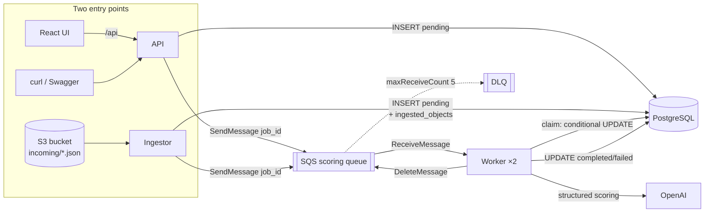
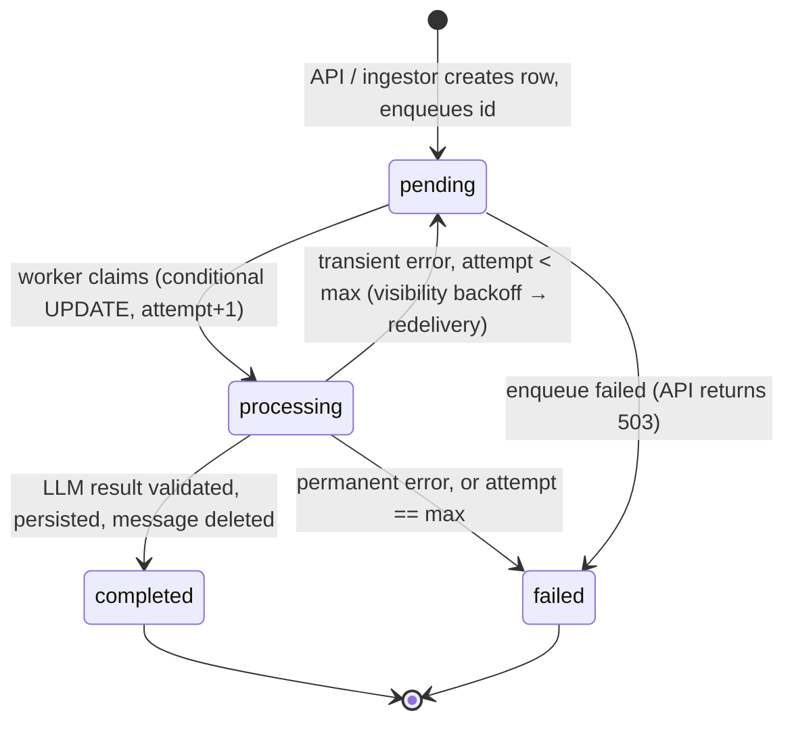

# Local architecture — what actually runs on your machine

Everything below runs inside one `kind` cluster on your laptop. The only network call that leaves
the machine is the request to OpenAI.

## Components

| Component | Runs as | Image | Purpose |
|---|---|---|---|
| `api` | Deployment ×1 | `convoscore-backend` | REST API, job creation, review queries, `/metrics`, probes |
| `worker` | Deployment ×2 | `convoscore-backend` | long-polls SQS, claims jobs, calls OpenAI, persists results |
| `ingestor` | Deployment ×1 | `convoscore-backend` | polls S3 `incoming/`, de-duplicates, creates jobs |
| `web` | Deployment ×1 | `convoscore-web` | React UI served by nginx; proxies `/api` to the API service |
| `postgres` | StatefulSet ×1 + PVC | `postgres:16` | source of truth for jobs and results |
| `localstack` | Deployment ×1 | `localstack/localstack:4.14.0` | S3 + SQS + IAM emulation (namespace `localstack`) |
| `prometheus` | Helm release | `prometheus-community/prometheus` | scrapes pods by annotation; kube-state-metrics included |
| `grafana` | Helm release | `grafana/grafana` | one provisioned dashboard: *ConvoScore Overview* |

The API serves `/metrics` on its own port; the worker and ingestor serve theirs on 9100. All three
opt in to scraping with `prometheus.io` pod annotations, so no operator or CRD is involved. See
[observability.md](observability.md).

Namespaces: `convoscore` (application + PostgreSQL), `localstack`, `monitoring`.

## Data flow

## Job state machine

Transient errors: timeout, 429, 5xx, connection errors, first schema-invalid response.
Permanent errors: 400/401/403, second schema-invalid response, unknown job.
Backoff between attempts: `min(60, 5 · 2^attempt)` seconds plus jitter, applied through
`ChangeMessageVisibility`, so retries survive a worker restart.

## Ports and URLs

`kind` maps NodePorts to `127.0.0.1` so no ingress controller is needed.

| Service | NodePort | Host URL |
|---|---|---|
| web | 30880 | http://127.0.0.1:8080 |
| api | 30800 | http://127.0.0.1:8000 (Swagger at `/docs`) |
| grafana | 30300 | http://127.0.0.1:3000 |
| prometheus | 30900 | http://127.0.0.1:9090 |
| localstack | 31566 | http://127.0.0.1:4566 (Terraform and the demo upload script use this) |

Inside the cluster the application reaches LocalStack at
`http://localstack.localstack.svc.cluster.local:4566` and PostgreSQL at
`convoscore-postgres.convoscore.svc.cluster.local:5432`.

## Configuration and secrets

- Non-secret configuration (queue name, bucket name, model, prompt version, demo mode, poll
  intervals) is a ConfigMap rendered from Helm values. Bucket and queue names come from
  `terraform output`.
- Secrets are created by `make up` from the gitignored `.env`, never by the chart:
  `convoscore-openai` (`OPENAI_API_KEY`) and `convoscore-postgres` (generated password, created
  once and reused).
- LocalStack credentials are the dummy `test` / `test` pair; they are labelled as such.

## Startup sequence (`make up`)

1. Preflight: Docker running, `kind`, `kubectl`, `helm`, `terraform` present, `.env` present.
2. Create the kind cluster from `platform/kind-config.yaml` if it does not exist.
3. Apply `platform/localstack.yaml`; wait for `/_localstack/health`.
4. `terraform apply` against `127.0.0.1:4566` → bucket, queue, DLQ, IAM policies/roles.
5. Install Prometheus and Grafana charts into `monitoring`.
6. Build the two images, `kind load` them.
7. Create the `convoscore` namespace and secrets.
8. `helm upgrade --install convoscore` with the image tag and Terraform outputs; wait for readiness.
9. Print URLs and next steps.

Every step is idempotent; re-running `make up` after a code change rebuilds and rolls out.

Migrations run in an init container on the API pod (retrying until PostgreSQL is reachable,
holding an advisory lock). Worker and ingestor wait for the schema version before starting.

## Health and probes

| Process | Liveness | Readiness |
|---|---|---|
| api | `/healthz` — process is up | `/readyz` — PostgreSQL reachable (SQS/S3 status is reported in `/api/health/details` but does not gate readiness) |
| worker | heartbeat file newer than 180 s | n/a (no Service) |
| ingestor | heartbeat file newer than 120 s | n/a |
| web | nginx answers `/healthz` | same |
| postgres | `pg_isready` | `pg_isready` |

An OpenAI outage therefore never causes Kubernetes to restart healthy pods; it shows up as failed
LLM calls and retries in metrics, which is the correct signal.

The worker and ingestor are loops rather than servers, and Kubernetes already restarts a container
whose process exits. Their probes exist to catch a process that is *stuck*: each loop pass touches
a file, and the probe checks its age. The thresholds allow a full long poll plus an LLM timeout
plus retry backoff before declaring a stall. Full detail in [observability.md](observability.md).

## Durability demo

PostgreSQL data lives on a PersistentVolumeClaim backed by kind's local-path provisioner. It
survives pod deletion, rollouts and Docker restarts; only `kind delete cluster` (`make down`)
removes it. `make demo-restart` restarts every application component, deletes the PostgreSQL pod,
and re-reads the results through the API to prove nothing was lost.

## What is deliberately not here

Ingress controller, HPA/KEDA, NetworkPolicy, PodDisruptionBudget, Alertmanager routing, ArgoCD,
service mesh, Redis, Kafka, Lambda. Each is discussed in
[architecture-production-aws.md](architecture-production-aws.md) or [DECISIONS.md](../DECISIONS.md).
